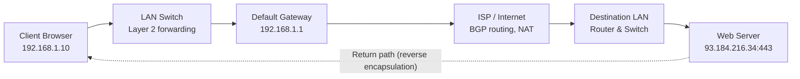

# Tracing a TCP/IP Communication: Opening a Secure Website (HTTPS)

**Team-05 | International Cybersecurity & Digital Forensics Academy (ICDFA) | Academic Session 2026**

> A layer-by-layer analysis of how a single click becomes a secure web page, traced from the sender's browser to the web server and back using the TCP/IP model.

---

## Project Overview

This project was prepared by a team of junior network analysts. It traces one communication scenario, **opening a secure website (HTTPS)**, from the sending device to the destination and back.

It explains what happens at each TCP/IP layer, which protocols are involved, how encapsulation and decapsulation work, and how addressing (IP, MAC, ports) moves data across the network. It also compares TCP and UDP and walks through the diagnosis of one realistic communication failure.

## Team Members

|  | Name | Registration No. |
|---|------|------------------|
| 1 | Emmanuel Adie Ushie (Team Lead) | C11/26/FCDF/17173 |
| 2 | Abubakar Bello Sadiq | C11/26/FCDF/17161 |
| 3 | Adeyemo Adetoye | C11/26/FCDF/17140 |
| 4 | Nokukhanya Tenza | C11/26/FCDF/17149 |
| 5 | Vugomi Rhulani Mathye | C11/26/FCDF/17157 |

## Learning Outcomes Covered

- Explain the functions of the four TCP/IP layers
- Map TCP/IP layers to the OSI model
- Trace data through encapsulation and decapsulation
- Explain the roles of IP addresses, MAC addresses, port numbers and protocols
- Compare TCP and UDP and select the right transport protocol for an application
- Diagnose a basic TCP/IP communication failure with a logical approach
- Communicate technical information clearly as an accountable team

## Scenario Summary

A user at `192.168.1.10` opens `https://portal.company.com`. The request travels to a web server at `93.184.216.34` on port `443`.

| Step | Layer | What happens |
|------|-------|--------------|
| 1 | Application | DNS resolves the domain name to an IP address (UDP/53); the browser builds an HTTP GET request; TLS 1.3 encrypts it |
| 2 | Transport | TCP three-way handshake on port 443 (SYN, SYN-ACK, ACK); source port `51342`, destination port `443` |
| 3 | Internet | IP header added (Src `192.168.1.10`, Dst `93.184.216.34`); routers forward using the destination IP |
| 4 | Network Access | ARP finds the gateway MAC; packet is framed in Ethernet with source/destination MAC; MACs are rewritten at every hop |
| 5 | Receiver | Frame stripped, packet extracted, TCP segments reassembled, TLS payload decrypted into the HTTP GET |
| 6 | Return path | The server's response is encapsulated the same way in reverse and decapsulated by the client's browser |

---  

## Video Presentation Link   
https://shorturl.at/s2Ywm  

## Packet Journey (Diagram)



The original packet journey diagram is on **Slide 5** of the presentation. Add the exported image to the repository (for example `assets/packet-journey.png`) and embed it with:

```markdown

```

## Protocol Analysis Summary

| Layer | Protocol | PDU | Addressing Info | Purpose |
|-------|----------|-----|-----------------|---------|
| Application | DNS | Data (message) | Domain name to IP address | Resolves the domain name before anything else happens |
| Application | HTTP over TLS (HTTPS) | Data (message) | None (relies on ports) | Requests the page and carries the encrypted response |
| Transport | TCP | Segment | Src 51342 / Dst 443 | Reliable, ordered connection via three-way handshake |
| Internet | IP | Packet | Source IP / Destination IP | Logical addressing and routing across networks |
| Network Access | Ethernet / Wi-Fi | Frame | Source MAC / Destination MAC | Delivery across one local link; re-applied at every hop |

## TCP vs UDP at a Glance

| Feature | TCP | UDP |
|---------|-----|-----|
| Connection | Connection-oriented (3-way handshake) | Connectionless |
| Reliability | Retransmits lost segments | No retransmission |
| Ordering | Guaranteed | Not guaranteed |
| Flow control | Sliding window | None |
| Overhead | Higher | Lower (8-byte header) |
| Examples | HTTPS, email (SMTP) | VoIP / live calls, DNS lookups |

## Troubleshooting Case

**Failure:** An employee opens `https://portal.company.com` and the browser blocks access (`NET::ERR_CERT_DATE_INVALID`, "Your connection is not private"), while other traffic works normally.

**Method:** work up the stack, one layer at a time.

1. Physical link: `ip link` / `ifconfig` shows the interface UP
2. IP connectivity: `ping` the default gateway succeeds
3. DNS resolution: `nslookup` returns a valid IP
4. Port reachability: `telnet` / `nc` shows port 443 open
5. TLS handshake probe: `openssl s_client` reports the certificate as **EXPIRED**

**Resolution:** re-issue the certificate through a trusted CA, install the full certificate chain on the web server, reload the service, and verify with OpenSSL.

## Repository Contents

| File | Description |
|------|-------------|
| `README.md` | Project overview (this file) |
| `REPORT.md` | Full technical report |
| `TCP_IP_Communication_Opening_a_Secure_Website.pptx` | Presentation slides (10 to 12 content slides plus title and reference slides) |
| Video presentation | Link: _add Microsoft Teams recording or secure HTTPS link here_ |

## References

1. IETF RFC 8446: *The Transport Layer Security (TLS) Protocol Version 1.3*
2. IETF RFC 793: *Transmission Control Protocol (TCP) Specification*
3. Cisco Networking Academy: *CCNA Routing & Switching: Introduction to Networks*
4. ICDFA Network Security Fundamentals, Module 03: *Network Devices, Media, Ethernet and ARP*

---

*Prepared for the International Cybersecurity and Digital Forensics Academy (icdfa.edu.ng), Team-05, Session 2026.*

