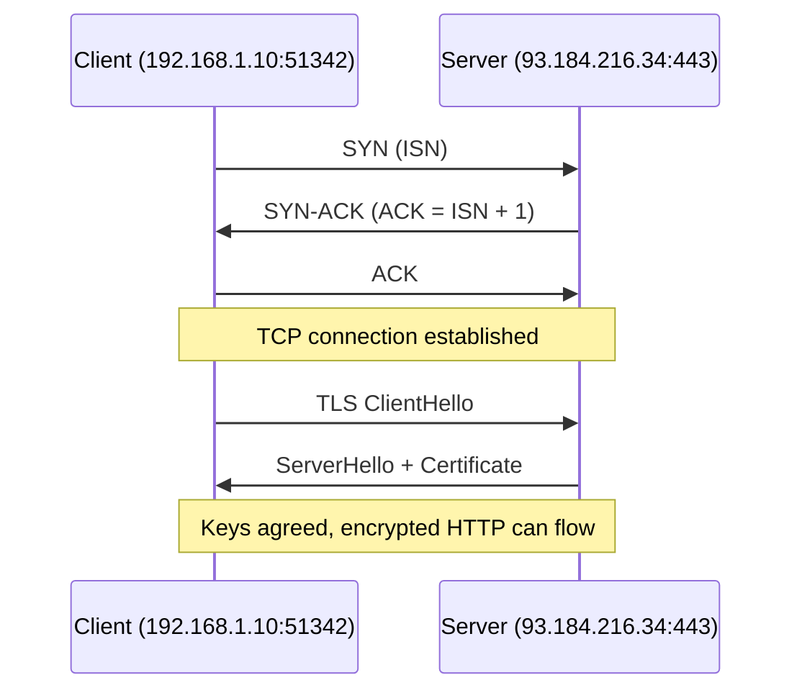
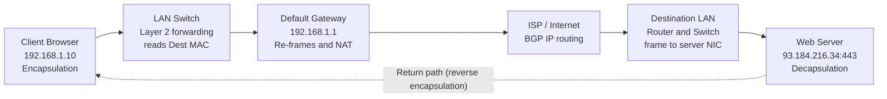
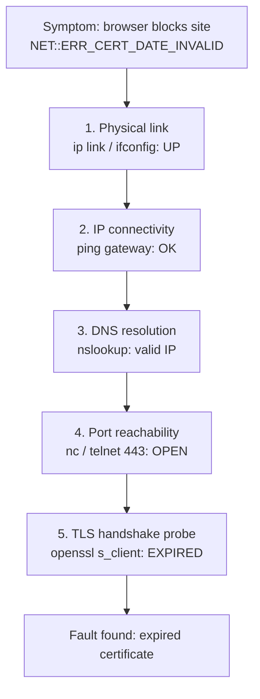

# Technical Report: Tracing a TCP/IP Communication, Opening a Secure Website (HTTPS)

**Team-05 | International Cybersecurity & Digital Forensics Academy (ICDFA) | WADF105 Network Security Fundamentals | Academic Session 2026**

> A layer-by-layer analysis of how a single click becomes a secure web page, from the sending browser to the destination web server and back.

[Back to project overview (README)](README.md)

---

## Team

| # | Name | Registration No. | Role |
|---|------|------------------|------|
| 1 | Emmanuel Adie Ushie | C11/26/FCDF/17173 | Team Lead and Packet Journey Lead |
| 2 | Abubakar Bello Sadiq | C11/26/FCDF/17161 | Protocol and Addressing Analyst |
| 3 | Adeyemo Adetoye | C11/26/FCDF/17140 | Presentation Design and Documentation Lead |
| 4 | Nokukhanya Tenza | C11/26/FCDF/17149 | Troubleshooting Lead |
| 5 | Vugomi Rhulani Mathye | C11/26/FCDF/17157 | Transport Protocol Comparison Lead |

---

## Table of Contents

1. [Executive Summary](#1-executive-summary)
2. [Introduction and Objectives](#2-introduction-and-objectives)
3. [Approach and Methodology](#3-approach-and-methodology)
4. [The TCP/IP Model and OSI Mapping](#4-the-tcpip-model-and-osi-mapping)
5. [Tracing the Communication, Layer by Layer](#5-tracing-the-communication-layer-by-layer)
6. [Original Packet Journey Diagram](#6-original-packet-journey-diagram)
7. [Protocol Analysis](#7-protocol-analysis)
8. [Addressing: IP Addresses, MAC Addresses and Port Numbers](#8-addressing-ip-addresses-mac-addresses-and-port-numbers)
9. [Transport Layer: TCP versus UDP](#9-transport-layer-tcp-versus-udp)
10. [Troubleshooting a Communication Failure](#10-troubleshooting-a-communication-failure)
11. [Team Organisation and Contribution Record](#11-team-organisation-and-contribution-record)
12. [Declaration of AI Assistance](#12-declaration-of-ai-assistance)
13. [Conclusion](#13-conclusion)
14. [References](#14-references)

---

## 1. Executive Summary

This report documents the work of Team-05, a group of junior network analysts, on the ICDFA TCP/IP Communication Trace project. The team selected the scenario **Opening a Secure Website (HTTPS)** and traced one complete communication from the sending device to the destination web server and back, explaining what happens at every layer of the TCP/IP model.

The scenario was chosen because a single HTTPS page load exercises the whole protocol stack: DNS name resolution, the TCP three-way handshake, the TLS 1.3 handshake and encryption, HTTP request and response, IP routing, ARP, and Ethernet framing. Every assessment criterion therefore has a clear home within one journey.

**Key findings**

- **Layered responsibility.** Each of the four TCP/IP layers performs one job. The Application layer prepares the message, the Transport layer gets it there reliably (or fast), the Internet layer finds the destination network, and the Network Access layer moves the bits physically.
- **Encapsulation and decapsulation.** The client wraps data into a segment, then a packet, then a frame. The server removes the headers in reverse order. The response travels the same way in the opposite direction.
- **Three kinds of addressing work together.** Port numbers (51342 to 443) identify applications, IP addresses (192.168.1.10 to 93.184.216.34) identify devices across networks, and MAC addresses identify devices on a single local hop. IP addresses stay constant end to end, while MAC addresses are rewritten at every router.
- **Transport choice matters.** TCP is the correct choice for HTTPS because the page must arrive complete and in order. UDP is better suited to real-time voice and video and to single-shot DNS lookups.
- **Layered troubleshooting works.** A realistic failure (an expired TLS certificate) was isolated by checking the stack one layer at a time. Layers 1 to 4 passed their checks, and the TLS probe pinpointed the fault.

---

## 2. Introduction and Objectives

### 2.1 Project Background

The team was appointed as a group of junior network analysts and tasked with preparing a clear technical presentation showing how information travels across a network using the TCP/IP model. One communication scenario had to be selected from four options: opening a secure website, sending an email, joining an online video meeting, or transferring a file between two computers.

### 2.2 Scenario Selection

The team chose **Opening a Secure Website (HTTPS)**. Sending an email or transferring a file touches fewer protocols, and a video call relies almost entirely on UDP and real-time transport, which is harder to diagram across all four layers. HTTPS naturally exercises DNS, TCP's three-way handshake, TLS, HTTP, IP routing and a well-known destination port (443).

### 2.3 Learning Outcomes Addressed

By completing this project the team demonstrates the ability to:

1. Explain the functions of the four layers of the TCP/IP model.
2. Map the TCP/IP layers to the corresponding OSI model layers.
3. Trace data through encapsulation and decapsulation from sender to receiver.
4. Explain the roles of IP addresses, MAC addresses, port numbers and protocols during network communication.
5. Compare TCP and UDP and select the appropriate transport protocol for different applications.
6. Diagnose a basic TCP/IP communication failure using a logical troubleshooting approach.
7. Communicate technical information clearly and demonstrate accountable teamwork.

### 2.4 Scenario Parameters

These values are used consistently throughout the report and the presentation.

| Parameter | Value |
|-----------|-------|
| Client (sender) IP address | `192.168.1.10` |
| Default gateway | `192.168.1.1` |
| Web server IP address | `93.184.216.34` |
| Client ephemeral port | `51342` |
| Server port (HTTPS) | `443` |
| DNS port | `53` (UDP) |
| Example domain | `portal.company.com` |
| Encryption | TLS 1.3 |

---

## 3. Approach and Methodology

The team used a structured, layer-by-layer method. A shared technical walkthrough served as the backbone for the whole project, and each team member owned one deliverable end to end.

1. **Scenario and scope agreed.** The team confirmed the HTTPS scenario and assigned five roles.
2. **Shared technical script.** A common walkthrough named the actual protocol, header field or data unit involved at each step, so that every section stayed consistent.
3. **Layer-by-layer tracing.** The journey was followed from the Application layer down to the Network Access layer on the sender, across the network, and back up the stack on the receiver.
4. **Evidence production.** Each owner produced a specific piece of evidence: the packet journey diagram, protocol analysis table, TCP vs UDP comparison, and troubleshooting walkthrough.
5. **Verification.** Technical details were checked against the authoritative references listed in [Section 14](#14-references) before submission.
6. **Presentation and submission.** The findings were compiled into a 14-slide deck (12 content slides), delivered as a group video presentation, and published with this report.

---

## 4. The TCP/IP Model and OSI Mapping

The TCP/IP model has four layers. Think of them as four specialists, each caring only about its own part of the job. As data moves down the stack on the sender, each layer adds its own header. As data moves up the stack on the receiver, each layer reads and removes only its own header.

| TCP/IP layer | PDU | Role | OSI layer(s) |
|--------------|-----|------|--------------|
| **Application** | Data | *"Prepares the message."* Builds the HTTP GET request, starts TLS 1.3 encryption and runs DNS lookups. | 7 Application, 6 Presentation, 5 Session |
| **Transport** | Segment | *"Gets it there reliably (or fast)."* Manages ports (source 51342, destination 443), connection state, sequencing and retransmission. | 4 Transport |
| **Internet** | Packet | *"Finds the destination network."* Attaches logical IP addresses to enable cross-network routing. | 3 Network |
| **Network Access** | Frame | *"Moves the bits physically."* Encapsulates packets into Ethernet frames with MAC addresses across the local cable or Wi-Fi link. | 2 Data Link, 1 Physical |

> [!NOTE]
> **Key distinction.** The TCP/IP model folds session handling and presentation syntax directly into its Application layer. This creates a more compact, implementation-driven architecture than the seven-layer OSI model, which separates them into Layers 5 and 6.

### 4.1 OSI Seven-Layer Reference

The table below gives the full OSI breakdown that sits behind the mapping above.

| OSI layer | Name | Core role | Data unit | Key protocols / devices |
|-----------|------|-----------|-----------|-------------------------|
| 7 | Application | Network services for user software | Data | HTTP, HTTPS, SMTP, DNS |
| 6 | Presentation | Translation, encryption and compression | Data | SSL/TLS, JPEG, MP4 |
| 5 | Session | Creates, manages and ends connections | Data | APIs, sockets, NetBIOS |
| 4 | Transport | End-to-end delivery and error checking | Segments | TCP, UDP |
| 3 | Network | Logical routing across different networks | Packets | IPv4, IPv6, routers |
| 2 | Data Link | Local delivery between directly connected devices | Frames | Switches, MAC addresses, Wi-Fi |
| 1 | Physical | Transmits raw bits over cables or waves | Bits | Cables, hubs, fibre optics |

---

## 5. Tracing the Communication, Layer by Layer

### 5.1 Phase 1: Application Layer, Building the Secure Request

Before any packet leaves the client, three things happen at the Application layer.

**DNS resolution.** The browser needs an IP address for the domain, so it sends a DNS query over UDP port 53 to a resolver. The reply is an A or AAAA record containing the server's IP address. A quick single lookup does not need the overhead of a TCP connection, which is why DNS normally uses UDP. No connection can begin until this step is complete.

**HTTP GET construction.** The browser formats an HTTP/1.1 or HTTP/2 GET request, assembling the request headers, the Host identifier, user-agent parameters and the expected MIME types. The PDU at this stage is plain application data with no networking headers on it yet.

**TLS 1.3 encryption.** Before leaving the client, the application data is handed to TLS 1.3 for symmetric encryption. This turns plaintext HTTP into secure HTTPS and means the request is encrypted before it ever reaches the network. The destination port is 443 and the payload is an encrypted TLS record.

### 5.2 Phase 2: Transport and Internet Layers, Session and Routing

#### TCP three-way handshake (port 443)

Before any real data moves, TCP establishes a connection. Only after the handshake completes does TLS run its own handshake (client hello, server hello with certificate, and key exchange) to agree on encryption keys.

| Step | Direction | Action |
|------|-----------|--------|
| 1. SYN | Client to server | The client selects an Initial Sequence Number (ISN) and sends a segment with the SYN flag set. |
| 2. SYN-ACK | Server to client | The server acknowledges the client ISN (ACK = ISN + 1) and sends its own sequence number. |
| 3. ACK | Client to server | The client acknowledges the server's sequence number. The reliable socket is now ready for the TLS exchange. |



#### Headers added during packaging

- **Transport layer (segment).** TCP breaks the HTTP request into segments and stamps each one with a source port (the ephemeral port `51342`, chosen by the operating system) and a destination port (`443`). The port pair is how the operating system knows which application a reply belongs to. TCP also adds sequence and acknowledgment numbers so that segments can be reordered and re-sent if lost.
- **Internet layer (packet).** IP wraps each segment in a packet and adds the source IP address (`192.168.1.10`) and the destination IP address (`93.184.216.34`, learned from DNS).

> [!NOTE]
> **Cross-network routing.** Routers across the internet examine only the destination IP address to forward the packet hop by hop. The transport port numbers and the TLS payload remain untouched end to end. This is also the layer where NAT, if present, rewrites the private source IP address to a public one.

### 5.3 Phase 3: Network Access Layer, Local Frame Delivery and ARP

At the last step before anything leaves the device, the packet becomes a frame. Ethernet or Wi-Fi adds a source MAC address and a destination MAC address, but only for the next physical hop, not for the whole journey. The network card then converts the frame into electrical, radio or optical signals (bits).

- **Frame Check Sequence (FCS).** A Cyclic Redundancy Check (CRC) is added so that the receiver can validate that the signal was not corrupted during physical transmission.
- **Hop-by-hop replacement.** MAC addresses are stripped and rebuilt at every router interface along the path, while IP addresses remain constant.

**Address Resolution Protocol (ARP).** The client knows its gateway IP address (`192.168.1.1`) but needs the gateway's physical MAC address to send the frame over the wire. It resolves this in two steps:

1. **ARP broadcast request:** "Who has 192.168.1.1? Tell 192.168.1.10," sent to every host on the LAN (`FF:FF:FF:FF:FF:FF`).
2. **Unicast ARP reply:** the router answers with its MAC address, and the client caches the mapping in its local ARP table for immediate frame dispatch.

---

## 6. Original Packet Journey Diagram

The team's original packet journey diagram traces the communication from the sender through the network devices to the destination and back. Encapsulation, re-framing and decapsulation are marked on the relevant devices.


*Figure 1: Original packet journey diagram (Slide 5 of the presentation).*

The same path as a text-rendered diagram:



### 6.1 Devices on the Path

| Device | Address / detail | Role in this scenario |
|--------|------------------|-----------------------|
| **Client browser** | `192.168.1.10` | Builds the request, performs DNS and TLS, originates the TCP session. Marks the point of encapsulation. |
| **LAN switch** | Layer 2 forwarding | Reads the destination MAC address and forwards the frame inside the local network. |
| **Default gateway (router)** | `192.168.1.1` | First hop off the LAN. Reads the destination IP, strips the old frame and builds a new frame for the next hop. Re-frames and applies NAT. |
| **ISP / internet** | Transit network | BGP-based IP routing between autonomous systems. The packet is re-framed at every router it crosses. |
| **Destination LAN** | Router and switch | The destination router hands the packet to the destination switch, which delivers the final frame to the server's network card. |
| **Web server** | `93.184.216.34`, port `443` | Listens on port 443, decapsulates the frame, decrypts the TLS payload and returns the response. |

### 6.2 Encapsulation on the Sender

Every layer on the sending side adds its own header on top of what the layer above gave it. By the time the request leaves the laptop, it carries an HTTP request inside a TCP header, inside an IP header, inside an Ethernet header, nested like Russian dolls.

```
Data (TLS / HTTP GET)
  -> TCP Segment    (51342 -> 443)
  -> IP Packet      (192.168.1.10 -> 93.184.216.34)
  -> Ethernet Frame (PC MAC -> Gateway MAC)
```

### 6.3 Decapsulation on the Receiver

The receiving side performs the exact opposite, removing one header at a time as the message moves up its stack.

```
NIC strips Ethernet Frame
  -> IP Packet extracted, destination confirmed
  -> TCP segments reassembled
  -> TLS payload decrypted into HTTP GET
```

### 6.4 Header Summary

| Layer | PDU | Header information added | Sender / receiver order |
|-------|-----|--------------------------|-------------------------|
| Application | Data | HTTP request, TLS-encrypted | Built first / reassembled last |
| Transport (TCP) | Segment | Source port 51342, destination port 443, sequence and acknowledgment numbers | Added 2nd / removed 3rd |
| Internet (IP) | Packet | Source IP 192.168.1.10, destination IP 93.184.216.34 | Added 3rd / removed 2nd |
| Network Access | Frame | Source MAC, destination MAC (changes every hop), FCS | Added last / removed first |

### 6.5 Return Path

The web server's TLS/HTTP response is encapsulated in the same way in reverse. It is routed across the internet routers and decapsulated by the client's browser, completing the round trip.

---

## 7. Protocol Analysis

The protocol analysis table maps every protocol involved in opening a secure website to its TCP/IP layer, protocol data unit, addressing information and purpose. Each layer only needs to understand its own protocol and addressing scheme, which lets the whole stack work together without any one layer needing to know how the others do their job.

| Layer | Protocol | PDU | Addressing info | Purpose |
|-------|----------|-----|-----------------|---------|
| Application | DNS | Data (message) | Domain name to IP address | Resolves the website's domain name to an IP address before anything else can happen. |
| Application | HTTP over TLS (HTTPS) | Data (message) | None (relies on ports below) | Requests the web page and carries the encrypted response back from the server. |
| Transport | TCP | Segment | Source port 51342 / destination port 443 | Reliable, ordered, connection-based delivery; opens the session through the three-way handshake. |
| Internet | IP | Packet | Source IP / destination IP | Logical addressing and routing; moves packets across internetworks. |
| Network Access | Ethernet / Wi-Fi | Frame | Source MAC / destination MAC | Physical delivery across one local link; re-applied at every hop. |

---

## 8. Addressing: IP Addresses, MAC Addresses and Port Numbers

IP and MAC addresses answer two different questions. The IP address answers *"which network, and where on the internet?"* The MAC address answers *"which physical device, on this one local link?"* Port numbers answer a third question: which application on that device should receive the data?

### 8.1 IP Addresses versus MAC Addresses

| Property | MAC address (Layer 2, physical) | IP address (Layer 3, logical) |
|----------|---------------------------------|-------------------------------|
| **Nature** | Flat and non-routable. A physical hardware address burned into the network interface card (NIC). | Routable globally. A logical, software-assigned identifier showing where a device sits on the internetwork. |
| **Scope** | Meaningful only on the local segment, for a single hop. | Stays the same for the whole journey and is used by routers across the internet. |
| **Format** | 48 bits, 12 hexadecimal characters separated by colons, e.g. `00:1A:2B:3C:4D:5E`. | IPv4, hierarchical, split into network and host portions, e.g. `192.168.1.10/24`. |
| **Structure** | First 24 bits identify the vendor (OUI); the remaining 24 bits identify the unique interface. | Network portion plus host portion, defined by the subnet mask. |
| **Assignment** | Fixed in hardware at manufacture. | Static (manually assigned by an engineer) or dynamic (leased on boot via DHCP). |

### 8.2 IP Addressing Notes

- **Static IP:** manually assigned by an administrator, constant, and used for servers and infrastructure.
- **Dynamic IP:** assigned automatically by DHCP each time a device connects, which means less administration and is enabled by default.
- **Address schemes:** flat (no hierarchy) versus hierarchical (organised by network and subnet). Hierarchical addressing is how the internet scales.
- **Requirements for routing over the internet:** an IP address, a subnet mask, a default gateway and a DNS address for name lookups.
- **Internet structure:** the internet is made up of interconnected networks called Autonomous Systems (AS). Routing protocols such as BGP move packets between them, and each router's routing table decides the next hop toward the destination.

### 8.3 MAC Addressing Notes

- The first six hexadecimal characters (`00:1A:2B`) form the Organisationally Unique Identifier (OUI) that identifies the manufacturer.
- The last six characters (`3C:4D:5E`) are the device identifier, unique within that manufacturer's range.
- By allocation there are three types: **unicast** (one specific device), **multicast** (a group of devices) and **broadcast** (all devices on the local network).

### 8.4 Port Numbers

Once a packet has reached the correct device through its IP address, the operating system uses the port number to decide which application the data belongs to.

| Port | Service | Description |
|------|---------|-------------|
| `53` | DNS | Resolves domain names to IP addresses. Operates mainly over UDP, or over TCP for large zone transfers and query responses. |
| `443` | HTTPS (HTTP over TLS) | Encrypted, authenticated web traffic delivered over TCP and authenticated through X.509 server TLS certificates. Port 443 tells the receiver and any firewall in between to expect an encrypted session. |
| `51342` | Client ephemeral port | A dynamic client-side port chosen from the private range (49152 to 65535) to identify the specific browser process socket. |

> [!IMPORTANT]
> **Core rule.** Ports identify the specific application or service socket on a host, not the device itself. Finding the target computer is the IP address's job. Delivering data to the exact browser tab or server daemon is the port number's job.

---

## 9. Transport Layer: TCP versus UDP

### 9.1 Mechanics

Both protocols work at the Transport layer (Layer 4) and provide process-to-process communication using port numbers. The difference is in how much each one promises.

**TCP is connection-oriented and reliable.** It opens a session with the three-way handshake before any data is sent. It segments and reassembles data using sequence numbers, detects missing segments and retransmits them, and uses flow control (a sliding window) so a fast sender cannot overwhelm a slow receiver.

**UDP is connectionless and lightweight.** It has no handshake and no session. It dispatches datagrams immediately and relies on the application to handle any loss. There is no retransmission, no ordering guarantee and no flow control. This is a deliberate trade: with an 8-byte header and no setup, UDP achieves the lowest overhead and latency.

### 9.2 Comparison

| Feature | TCP | UDP |
|---------|-----|-----|
| **Connection** | Connection-oriented: three-way handshake (SYN, SYN-ACK, ACK) before data flows. | Connectionless: no handshake and no session; sends immediately. |
| **Reliability** | Reliable: lost segments are detected and retransmitted. | Unreliable: no retransmission; the application must handle loss if it matters. |
| **Ordering** | Guaranteed: sequence numbers reassemble data in the correct order. | Not guaranteed: datagrams may arrive out of order. |
| **Flow control** | Yes: a sliding window prevents overwhelming the receiver. | None. |
| **Speed / overhead** | Slower, higher overhead (headers, handshake and acknowledgments). | Faster, lower overhead (minimal 8-byte header, no setup). |
| **Data unit (PDU)** | Segment | Datagram |

### 9.3 Application Examples and Protocol Selection

| Protocol | Application 1 | Application 2 | Why this protocol fits |
|----------|---------------|---------------|------------------------|
| **TCP** | Web browsing (HTTPS, port 443) | Email (SMTP) | The full page or message must arrive complete and in order. Dropped, out-of-order or scrambled data is unacceptable in financial documents or source code. |
| **UDP** | Live video and voice calls (VoIP) | DNS lookups | Speed and freshness matter more than perfect delivery. A late retransmission is worse than a small gap in live audio, and DNS can simply retry if a query packet drops. |

The selection rule is simple: use TCP whenever correctness matters more than speed, and UDP whenever speed and freshness matter more than perfect delivery. TCP's design priority is data integrity and strict sequencing over low latency. UDP's design priority is the lowest possible latency and minimal processing overhead for real-time traffic.

---

## 10. Troubleshooting a Communication Failure

### 10.1 The Failure

An employee opens `https://portal.company.com` and the browser blocks entry with the message **"Your connection is not private"** and the error code `NET::ERR_CERT_DATE_INVALID`. The underlying LAN connection is fully operational, and standard web traffic and email continue to work normally.

### 10.2 Diagnostic Goal and Method

The goal is to isolate the exact failing layer methodically using standard networking tools rather than guessing. The administrator works up the stack, one layer at a time, and moves on only when the current layer passes.

| Step | Layer / check | Tool | Result |
|------|---------------|------|--------|
| 1 | Physical link | `ip link` / `ifconfig` | Interface is UP |
| 2 | IP connectivity | `ping` the default gateway | Gateway reachable (OK) |
| 3 | DNS resolution | `nslookup` | Resolves to a valid IP address |
| 4 | Port reachability | `telnet` / `nc` to port 443 | Port 443 is OPEN |
| 5 | TLS handshake probe | `openssl s_client` | Certificate reported as **EXPIRED** |



### 10.3 Diagnosis

Steps 1 to 4 pass, so the physical link, IP connectivity, DNS and the TCP path to port 443 are all healthy. The fault therefore sits at the TLS layer: the server's certificate has expired, so the browser refuses to trust the connection.

### 10.4 Remediation

1. Re-issue the TLS certificate through a trusted Certificate Authority (CA).
2. Bind the full certificate chain on the web server daemon.
3. Reload the service so the new certificate is served.
4. Verify the result with `openssl s_client` and by reloading the page in the browser.

> [!TIP]
> **Why this method works.** Working through the layers in order turns a vague complaint ("the site is not working") into a precise finding ("the certificate has expired"). It also rules out wasted effort on healthy layers, because DNS, routing and the open port were proven good before attention moved to TLS.

---

## 11. Team Organisation and Contribution Record

The work was divided into five roles. Each role owned one deliverable end to end and presented that section in the recording. Every member also submits an individual contribution declaration through the course portal.

| Member | Assigned role | Completed work and evidence |
|--------|---------------|-----------------------------|
| **Emmanuel Adie Ushie** | Team Lead and Packet Journey Lead | Original packet journey diagram (Slide 5) and the encapsulation/decapsulation walkthrough (Slide 6). Opening and closing content; coordination and final submission. Presented the introduction, the four TCP/IP layers and the diagram walkthrough (Slides 1 to 6). |
| **Abubakar Bello Sadiq** | Protocol and Addressing Analyst | Protocol analysis table (Slide 7). IP address, MAC address and port number explanations (Slides 8 and 9). |
| **Vugomi Rhulani Mathye** | Transport Protocol Comparison Lead | TCP vs UDP mechanics (Slide 10), comparison table (Slide 11) and application examples (Slide 12). |
| **Nokukhanya Tenza** | Troubleshooting Lead | Expired-certificate failure scenario and layered diagnostic method with remediation (Slide 13). |
| **Adeyemo Adetoye** | Presentation Design and Documentation Lead | Slide design and consistency, the references slide, the team contribution record (Slide 14), and recording and timing coordination. |

The slide references in the evidence column refer to the final 14-slide deck. Supporting evidence such as repository commits, drafts and recording timestamps is available in this repository and the submitted recording.

---

## 12. Declaration of AI Assistance

In line with the course requirement, the team declares that AI assistance (Claude, by Anthropic) was used to help prepare the team project brief, the presenter scripts and speaker notes, the project summary, and the repository README and this report.

- **Purpose of use.** AI was used as a support tool for structuring content, drafting wording and organising material. The scenario choice, the packet journey diagram, the failure case and the final slides remain the team's own work.
- **Verification.** All technical details were reviewed by the team against the course material and the listed references before submission.
- **Responsible use.** AI output was treated as a draft, not a final answer. The team corrected, adapted and approved all content, and no AI-generated text was submitted without human review.
- **Accountability.** Each member remains responsible for understanding and explaining the content, and each member presented in the recording and submitted an individual declaration.

---

## 13. Conclusion

Opening a secure website looks like a single action, but it is the cooperation of many protocols, each doing one job at its own layer. DNS finds the server, TCP builds a reliable connection, TLS encrypts the conversation, IP routes it across networks, and Ethernet carries it across each local hop. Encapsulation and decapsulation keep these jobs separate, while three addressing systems (ports, IP and MAC) make sure the data reaches the right application on the right device.

The TCP versus UDP analysis shows that the choice of transport protocol is a deliberate trade between reliability and speed, and the troubleshooting case shows that a systematic layer-by-layer method can turn a vague symptom into a precise, fixable cause. Together these findings meet the project's learning outcomes and give the team a practical foundation for network analysis and security work.

---

## 14. References

**Authoritative sources used in the presentation**

1. Internet Engineering Task Force (IETF). *RFC 8446: The Transport Layer Security (TLS) Protocol Version 1.3.*
2. Internet Engineering Task Force (IETF). *RFC 793: Transmission Control Protocol (TCP) Specification.*
3. Cisco Networking Academy. *CCNA Routing & Switching: Introduction to Networks.*
4. ICDFA Network Security Fundamentals. *Module 03: Network Devices, Media, Ethernet and ARP.*

**Additional standards for further reading**

5. Internet Engineering Task Force (IETF). *RFC 768: User Datagram Protocol.*
6. Internet Engineering Task Force (IETF). *RFC 791: Internet Protocol.*
7. Internet Engineering Task Force (IETF). *RFC 826: An Ethernet Address Resolution Protocol.*

---

*Team-05, International Cybersecurity and Digital Forensics Academy (icdfa.edu.ng), Academic Session 2026.*
